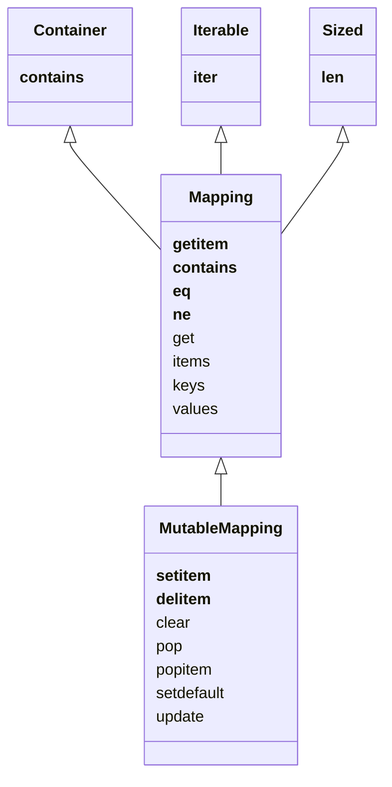

Specialized mappings often extend `dict` or `collections.UserDict` instead of ABCs.
All mapping types in the standard library use the basic `dict`, so they all require that the keys be *hashable*.

