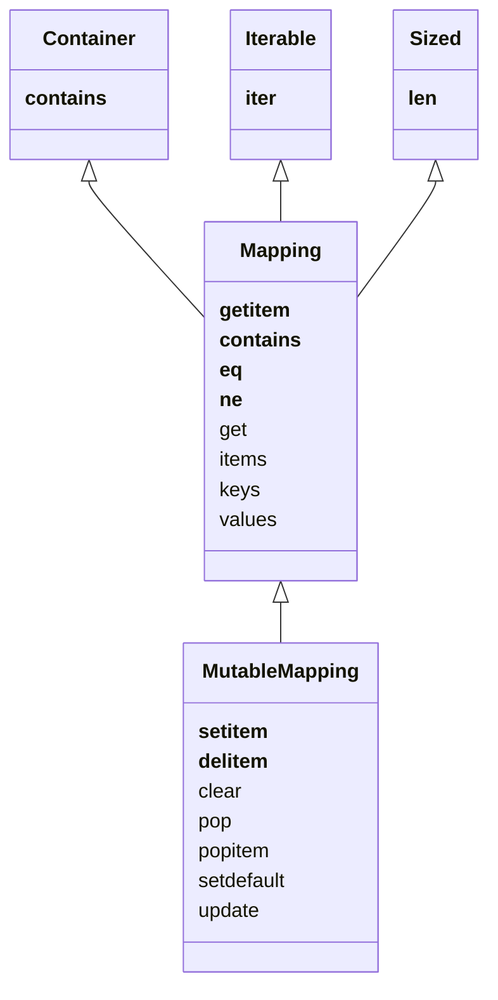

[[dict]]

Specialized mappings often extend `dict` or `collections.UserDict` instead of ABCs.

Testing using `isinstance(object, abc.Mapping)` is generally a good way to determine if an object is a Mapping.

All mapping types in the standard library use the basic `dict`, so they all require that the keys be *hashable*.

| Method                        | dict        | defaultdict | OrderedDict | Description                                                                                                                                                                                |
| ----------------------------- | ----------- | ----------- | ----------- | ------------------------------------------------------------------------------------------------------------------------------------------------------------------------------------------ |
| `.clear()`                    | :luc_check: | :luc_check: | :luc_check: | Remove all items                                                                                                                                                                           |
| `.__contains__(k)`            | :luc_check: | :luc_check: | :luc_check: | `k in d`                                                                                                                                                                                   |
| `.copy()`                     | :luc_check: | :luc_check: | :luc_check: | Shallow copy                                                                                                                                                                               |
| `.__copy__()`                 |             | :luc_check: |             | Support for `copy.copy`                                                                                                                                                                    |
| `.default_factory()`          |             | :luc_check: |             | Callable invoked by `__missing__` to set missing values ^[Not a method, but a callable instance attribute set by the end user when defaultdict is instantiated.]                           |
| `.__delitem__(k)`             | :luc_check: | :luc_check: | :luc_check: | `del d[k]` - Remove item with key `k`                                                                                                                                                      |
| `.fromkeys(it, initial=None)` | :luc_check: | :luc_check: | :luc_check: | New mapping from keys in iterable                                                                                                                                                          |
| `.get(k[, default])`          | :luc_check: | :luc_check: | :luc_check: | Get item with key `k`, return `default`                                                                                                                                                    |
| `.__getitem__(k)`             | :luc_check: | :luc_check: | :luc_check: | `d[k]` - Get item with key `k`                                                                                                                                                             |
| `.items()`                    | :luc_check: | :luc_check: | :luc_check: | Get *view* over items: list-like with tuples of (key, value)                                                                                                                               |
| `.__iter__()`                 | :luc_check: | :luc_check: | :luc_check: | Get iterator over keys                                                                                                                                                                     |
| `.keys()`                     | :luc_check: | :luc_check: | :luc_check: | Get list-like object containing all keys                                                                                                                                                   |
| `.__len__()`                  | :luc_check: | :luc_check: | :luc_check: | Number of items                                                                                                                                                                            |
| `.__missing__(k)`             |             | :luc_check: |             | Called when `__getitem__` cannot find the key                                                                                                                                              |
| `.move_to_end(k, last=True)`  |             |             | :luc_check: | Move `k` to first or last position                                                                                                                                                         |
| `.pop(k, default)`            | :luc_check: | :luc_check: | :luc_check: | Remove and return value at `k`, or default if missing.                                                                                                                                     |
| `.popitem()`                  | :luc_check: | :luc_check: | :luc_check: | Remove and return an arbitrary (key, value) item.^[OrderedDict.popitem() removes the first item inserted (FIFO), an optional last argument (defaults to False) pops the last item (LIFO).] |
| `.__reversed__()`             |             |             | :luc_check: | Get iterator for keys in reverse order (last to first inserted).                                                                                                                           |
| `.setdefault(k, default)`     | :luc_check: | :luc_check: | :luc_check: | If `k in d`, return `d[k]`. Else, set `d[k] = default` and return it.                                                                                                                      |
| `.__setitem__(k, v)`          | :luc_check: | :luc_check: | :luc_check: | `d[k] = v`                                                                                                                                                                                 |
| `.update(m[, **kargs])`       | :luc_check: | :luc_check: | :luc_check: | Update dict with items from mapping or iterable of (key, value) pairs.^[If m has a `__keys__` method, use as dict. Else, iterate and assume the items are (key, value) pairs.]                                                                                                                     |
| `.values()`                   | :luc_check: | :luc_check: | :luc_check: | List-like object containing all values                                                                                                                                                                                           |

----
# Sources
*Fluent Python*, Luciano Ramalho, 2015

