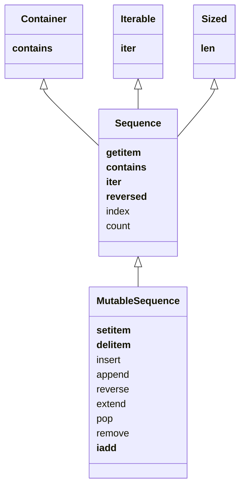

| Sequence Type     | Container/Flat | Mutability |
| ----------------- | -------------- | ---------- |
| list              | Container      | Mutable    |
| tuple             | Container      | Immutable  |
| collections.deque | Container      | Mutable    |
| str               | Flat           | Immutable  |
| bytes             | Flat           | Immutable  |
| bytearray         | Flat           | Mutable    |
| memoryview        | Flat           | Mutable    |
| array.array       | Flat           | Mutable           |

**Containers vs. Flat**
Containers hold references and can handle different types of items.
Flat sequences hold item values directly and can handle only one type.

