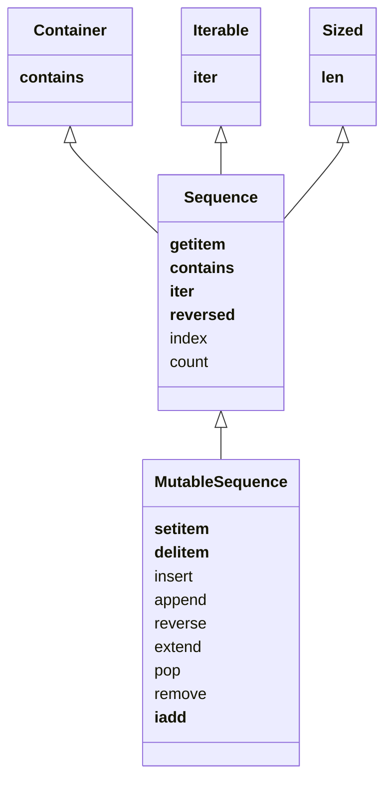

Sequences are collections that support numeric indexing and thus are ordered.
Examples include `list`, `tuple`, `str`, `bytes`.

```toc
```

## Classifying Sequences

### Container vs. Flat
Containers hold references to the objects they contain, and are able to hold different types of objects:  `list`, `tuple`
Flat sequences hold their values directly and can only contain one type: `str`, `bytes`

### Mutable vs. Immutable
Mutable sequences can be modified (reordered, added to, etc.) whereas immutable sequences are fixed.
The UML diagram describes (conceptually, not in implementation) the relationship between Mutable and Immutable sequences.



## Built-In Sequences
These are implemented in C and are typically very performant.
| Sequence Type     | Container/Flat | Mutability |
| ----------------- | -------------- | ---------- |
| list              | Container      | Mutable    |
| tuple             | Container      | Immutable  |
| collections.deque | Container      | Mutable    |
| str               | Flat           | Immutable  |
| bytes             | Flat           | Immutable  |
| bytearray         | Flat           | Mutable    |
| memoryview        | Flat           | Mutable    |
| array.array       | Flat           | Mutable    |

## Indexing
Positive indices are positions into the collection starting with zero.
Negative indices (not supported by all collections) start with `-1` as the last element and proceed to the left.
```python
numbers = [ 24, 2, 88, 26, 77, 71 ]
numbers[0]  # 24
numbers[2]  # 88
numbers[-1] # 71
numbers[-3] # 26
```

Assignment is only possible when replacing a single element:
```python
>>> x = list(range(10))
>>> x
[0, 1, 2, 3, 4, 5, 6, 7, 8, 9]
>>> x[3] = 33
>>> x
[0, 1, 2, 33, 4, 5, 6, 7, 8, 9]
>>> x[10] = 10
Traceback (most recent call last):
  File "<stdin>", line 1, in <module>
IndexError: list assignment index out of range
```

## Slicing
Reference a subset of a sequence in order.

Note that `stop` takes the number(s) up to, but not including index `stop` itself.
Numbers may be omitted with their place held by the `:`
```python
# 1-argument form:  [stop]
numbers[4]    # indices 0-3

# 2-argument form: [start:stop]
numbers[2:5]  # indices 2-4
numbers[:5]   # indices 0-4
numbers[2:]   # indices 2-end
numbers[:]    # ALL indices, 0-end

# 3-argument form: [start:stop:step]
numbers[2:8:2]  # indices 2, 4, 6
numbers[7:20:3] # indices 7, 10, 13, 16, 18
numbers[::2]    # Every other item (0, 2, 4...)
numbers[:12:2]  # indices 0, 2, 4, 6, 8, 10
numbers[5::2]   # indices 5, 7, 9, ... end
```

### Why Exclude the Last (stop) item?
- It's easy to see the length of the range returned:   `range(3)` and `list[:3]` return 3 items.
- It's easy to compute the length when start and stop are both used:  `list[4:9]` is 5 items (stop - start)
- It's easy to paginate or split a sequence into parts:
```python
mylist = list(range(101))
start = 0
length = 10
while start < len(mylist):
	stop = start + length
	print(mylist[start:stop])
	start = stop
```

```output
[0, 1, 2, 3, 4, 5, 6, 7, 8, 9]
[10, 11, 12, 13, 14, 15, 16, 17, 18, 19],
...
[90, 91, 92, 93, 94, 95, 96, 97, 98, 99],
[100]
```

### Assigning to Slices
This will replace the slice with the given values, even if they are of a different size:

```python
>>> x = list(range(10))
>>> x[3:5] = [ 33, 44, 55, 66 ]
>>> x
[0, 1, 2, 33, 44, 55, 66, 5, 6, 7, 8, 9]
```

To insert a number between other numbers, use a zero-length slice (start = stop)
```python
>>> x = list(range(10))
>>> x[3:3] = [ 33, 44, 55, 66 ]
>>> x
[0, 1, 2, 33, 44, 55, 66, 3, 4, 5, 6, 7, 8, 9]
```

## Common Sequence Operations
| Operation              | Result                                                                                                                       |
| ---------------------- | ---------------------------------------------------------------------------------------------------------------------------- |
| `x in s`               | `True` if an item of `s` is equal to `x`, else `False`.^[Sometimes used for subsequence testing, as `'car' in 'precarious'`] |
| `x not in s`           | `False` if an item of `s` is equal to `x`, else `True`.                                                                      |
| `s + t`                | Concatenation of `s` and `t`^[Results in new object if list is immutable.]                                                                                                 |
| `s * n` or `n * s`     | Adding `s` to itself `n` times ^[References, doesn't append. This can lead to difficult bugs.]                                                                                              |
| `s[i]`                 | `i`th item of `s` starting from 0 (see [[#Indexing]])                                                                        |
| `s[i:j]`               | Slice of `s` from `i` to `j` (see [[#Slicing]])                                                                              |
| `s[i:j:k]`             | Every `k`th item from `i` to `j` (see [[#Slicing]])                                                                          |
| `len(s)`               | Number of items in `s`                                                                                                       |
| `min(s)`               | Smallest item of `s`                                                                                                         |
| `max(s)`               | Largest item of `s`                                                                                                          |
| `s.index(x[, i[, j]])` | Index of 1st occurrence of `x` in `s`, at or after `i` but before `j` if given                                               |
| `s.count(x)`           | Number of occurrences of `x` in `s`                                                                                          |

## Sorting
`list.sort()` sorts a list in place without making a copy.
`sorted(list)` returns a new list in sorted order.

Both take keywords:
	- `reverse=True` (default `False`) to reverse the order
	- `key=function_name` to use a function as the key for sorting (e.g. `str.lower`, `len`).

## Arrays
`array.array` is more efficient than a list, but can contain only one type of value.
Supports standard mutable sequence methods (`.pop`, `.insert`, `.extend`)
Supports additional fast (de)serialization with `.frombytes` and `.tofile`

```python
>>> from array import array
>>> from random import random
>>> floats = array('d', (random() for i in range(10**7)))
>>> floats[-1]
0.7791442787359375
>>> fp = open('floats.bin', 'wb')
>>> floats.tofile(fp)
>>> fp.close()
>>> floats2 = array('d')
>>> fp = open('floats.bin', 'rb')
>>> floats2.fromfile(fp, 10**7)
>>> fp.close()
>>> floats2[-1]
0.7791442787359375
>>> floats2 == floats
True
```


----
# Sources
[Built-in Types — Python 3.11.2 documentation](https://docs.python.org/3/library/stdtypes.html)
*Fluent Python*, Luciano Ramalho, 2015
