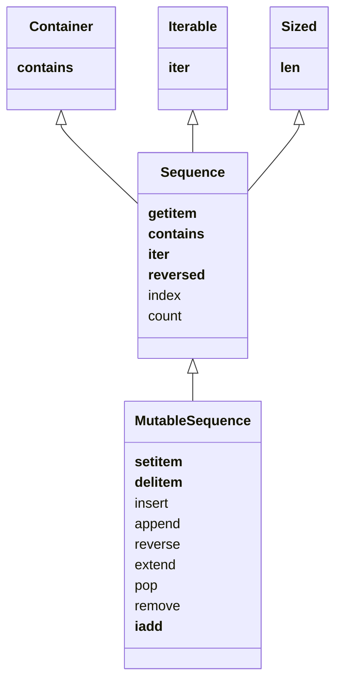

## Classifying Sequences

### Container vs. Flat
Containers hold references to the objects they contain, and are able to hold different types of objects:  `list`, `tuple`
Flat sequences hold their values directly and can only contain one type: `str`, `bytes`

### Mutable vs. Immutable
Mutable sequences can be modified (reordered, added to, etc.) whereas immutable sequences are fixed.
The UML diagram describes (conceptually, not in implementation) the relationship between Mutable and Immutable sequences.

