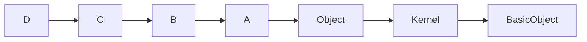
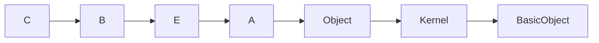
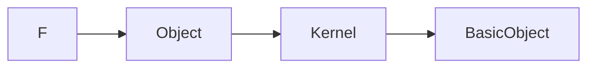

Can't be made into classes, but classes can inherit from (multiple) modules and only one parent class

**Human.rb**
```ruby
#---------------- in human.rb
module Human
	attr_accessor :name, :height, :weight
	def run; puts self.name + " runs"; end
end
#---------------- in smart.rb
module Smart
	def act_smart
		puts "e=mc^2"
	end
end
#---------------- in animal.rb
module Animal
	def make_sound; puts 'Grrr'; end
end
#---------------- in main.rb
require_relative 'human'
require_relative 'smart'
require_relative 'animal'

class Dog
	include Animal
end

Dog.new.make_sound   # Grrr

class Scientist
	include Human
	include Smart
	def act_smart; return "I are smart"; end   # Override from Human
end

einstein = Scientist.new
einstein.name = "Albert"
einstein.run          # Einstein runs
einstein.act_smart    # I are smart
```

## Inheritance Order and Overriding
`include` is inserted into chain between class and rest of chain
`extend` imports methods as class methods
`prepend` inserts the module at the base of the chain *before* the class itself and previously-prepended modules

This chain is used to resolve method calls from left to right.

```ruby
class D
  include A
  include B
  include C
end
```


```ruby
class E
  include A
  prepend B
  prepend C
end
```


```ruby
class F
  extend A
  extend B
  extend C
end
```

